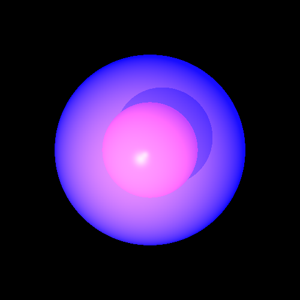
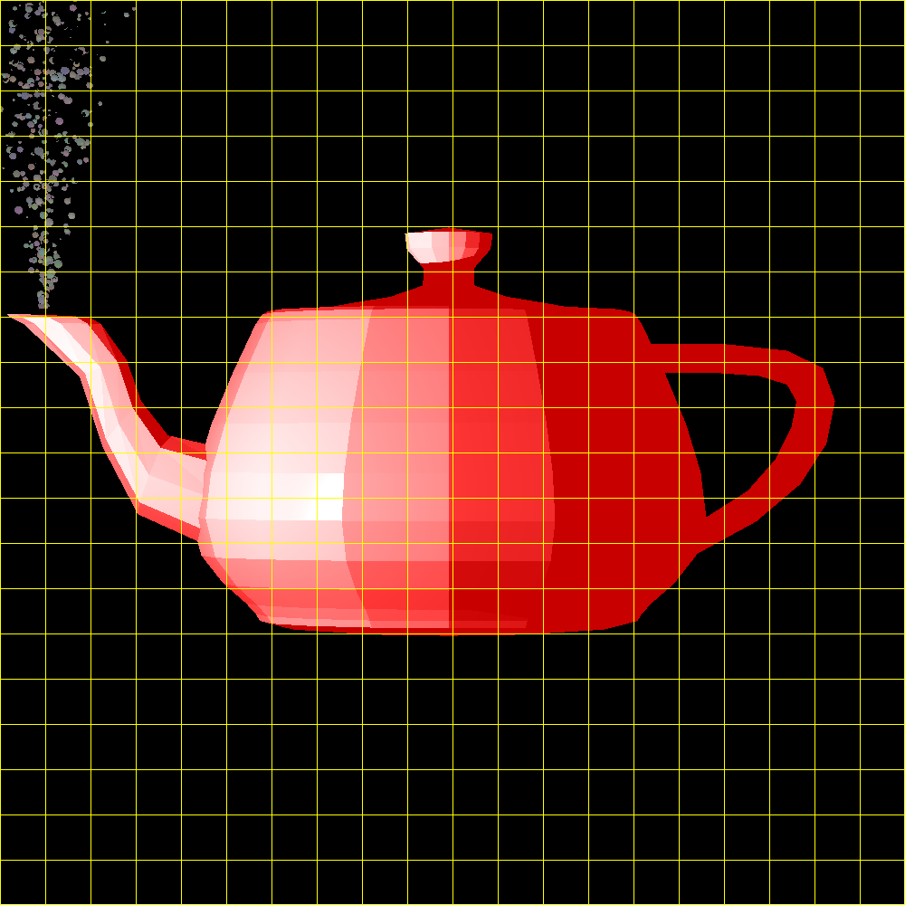

# Java Ray Tracer 🎇

A from-scratch **3D ray-tracing renderer** written in pure Java, built over a full
semester for the course *Mini Project in Introduction to Software Engineering* (151055).

Starting from nothing but `Point` and `Vector`, the project grows — stage by stage —
into a physically-inspired renderer with shadows, reflection, refraction, area lights,
anti-aliasing, multithreading and a bounding-volume acceleration structure.

<p align="center">
  
  
  
  
</p>

---

## ✨ What it can do

| Category | Features |
|----------|----------|
| **Geometry** | Sphere, Plane, Triangle, Polygon, Tube, finite Cylinder, and a `Geometries` composite |
| **Camera** | Configurable view plane via a fluent **Builder**; one ray per pixel → beam of rays |
| **Lighting** | Ambient, Directional, Point and Spot lights with full **Phong** shading (diffuse + specular) |
| **Materials** | Per-surface emission, diffuse/specular coefficients, **reflection** (`kR`) and **transparency** (`kT`) |
| **Effects** | Recursive reflection & refraction, hard **and** soft shadows, anti-aliasing |
| **Super-sampling** | A single reusable `BeamSampler` (jittered grid) powering anti-aliasing & soft shadows |
| **Performance** | Multithreading (raw threads **and** parallel streams) + a **Bounding-Volume Hierarchy** (CBR / manual / automatic) |
| **Scene loading** | Optional JSON scene parser (`parser/`) so scenes can be described as data |

---

## 🖼️ Gallery

### Reflection & refraction
Glass spheres, mirrors and coloured transparency, traced recursively.

<p align="center">
  
  
</p>

### Soft shadows (the assigned super-sampling effect)
Area lights cast a beam of shadow rays, producing realistic soft penumbrae instead of
hard edges.

<p align="center">
  
</p>

### Anti-aliasing
Multiple rays per pixel remove the jagged staircase edges.

<table align="center">
  <tr>
    <th>Without anti-aliasing</th>
    <th>With anti-aliasing</th>
  </tr>
  <tr>
    <td></td>
    <td></td>
  </tr>
</table>

### Triangle meshes
A classic Utah teapot rendered from a polygon mesh (yellow grid shows the bounding cells).

<p align="center">
  
</p>

---

## 🏗️ Architecture

The code follows a strict, layered package structure with the **Dependency Inversion
Principle** at its core: concrete geometries depend on abstractions, never the reverse.

```
src/
├── primitives/      Point, Vector, Ray, Color, Material, AABB, Util (math foundation)
├── geometries/
│   ├── api/         Intersectable, Geometry  (abstractions)
│   └── impl/        Sphere, Plane, Triangle, Polygon, Tube, Cylinder, Geometries
├── lighting/        Ambient / Directional / Point / Spot lights
├── renderer/        Camera (Builder), ImageWriter, ray tracers, BeamSampler, PixelManager
├── scene/           Scene  (geometries + lights + background)
├── parser/          JSON SceneLoader (SceneParser, GeometryFactory, LightFactory)
└── test/            Main.java  (primitive-level regression entry point)

unittests/           Mirror of src/ — full JUnit 5 test suite
```

### Design highlights

- **Immutability** — primitives and geometries are immutable; every operation returns a new object.
- **NVI / Template Method** — `findIntersections` is `final`; each geometry implements only
  `calcIntersectionsHelper`. The same pattern drives bounding-box creation and ray–box checks.
- **Builder pattern** — the `Camera` is assembled and validated through a fluent builder.
- **Composite pattern** — `Geometries` *is an* `Intersectable`, enabling the BVH to nest scenes
  inside scenes with no special tree class.
- **Strategy / reuse** — one `BeamSampler` feeds every super-sampling effect; no duplicated
  beam-generation or averaging logic.

---

## 🚀 Build & Run

This is a **plain IntelliJ IDEA project** (no Maven/Gradle). The two dependencies
(`org.json` and JUnit 5) are declared in `.idea/libraries/` and resolved from your local
Maven repository.

### In IntelliJ (recommended)

1. Open the project folder — IntelliJ reads `ISE5786_9749_5434.iml`.
2. Set the Project SDK to **Java 25**.
3. Mark `src/` as *Sources Root* and `unittests/` as *Test Sources Root* (already configured).
4. Run any test class in `unittests/renderer/` to produce an image in `images/`.

> 💡 Recommended VM options for the heavier scenes:
> `-Xms1G -Xmx8G -XX:+UseParallelGC -XX:ParallelGCThreads=4`

### From the command line

Run the primitive-level regression (should print only the success line, no `ERROR`):

```bash
# compile all sources
find src -name '*.java' > /tmp/srcfiles.txt
javac -d /tmp/out -cp ~/.m2/repository/org/json/json/20240303/json-20240303.jar @/tmp/srcfiles.txt

# run the regression
java -cp "/tmp/out:$HOME/.m2/repository/org/json/json/20240303/json-20240303.jar" test.Main
# → "If there were no any other outputs - all tests succeeded!"
```

---

## ✅ Testing

Tests are written with **JUnit 5** using **Equivalence Partitioning** and **Boundary Value
Analysis** — a few well-chosen cases per method rather than brute force. Geometry, lighting,
camera, parser and full render-pipeline tests all live under `unittests/`.

Run a single test class from the CLI against freshly compiled sources:

```bash
JUNIT=~/.m2/repository/org/junit/platform/junit-platform-console-standalone/1.14.0/junit-platform-console-standalone-1.14.0.jar
java -jar "$JUNIT" execute \
  -cp "/tmp/out:$HOME/.m2/repository/org/json/json/20240303/json-20240303.jar" \
  -c renderer.SphereTests --details=tree --disable-banner
```

Most renderer tests double as **image generators** — running them writes a `.png` into
`images/`, which is how every picture in this README was produced.

---

## 🗺️ Project roadmap

The renderer was built incrementally; each tagged stage adds one capability on top of the last.

| Tag | Milestone |
|-----|-----------|
| `PR01` | Primitives & geometric shapes |
| `PR02` | Unit tests + surface normals (TDD) |
| `PR03` | Ray–geometry intersections + `Geometries` composite |
| `PR04` | Camera (Builder) + ray construction + integration tests |
| `PR05` | Render pipeline + Color + ambient light + Scene |
| `PR06` | Emission + Material via the NVI `Intersection` cache |
| `PR07` | Light sources + Phong diffuse/specular shading |
| `PR08` | Shadows, reflection, transparency, partial shadow |
| `MP01` | **Super-sampling** — beam infrastructure, soft shadows, anti-aliasing, multithreading |
| `MP02` | **Acceleration** — Bounding-Volume Hierarchy (CBR → manual → automatic) |

---

## 🙏 Acknowledgments

- Built for course **151055 — Mini Project in Introduction to Software Engineering**.
- Base utility classes (`Util`, `Double3`, `Color`, `Polygon`, `ImageWriter`,
  `PixelManager`) were supplied by the course staff (author: *Dan Zilberstein*).
- The Utah teapot mesh is the classic computer-graphics test model.

---

<p align="center"><em>Everything you see above is computed pixel-by-pixel by Java code in this repository — no external graphics library.</em></p>
