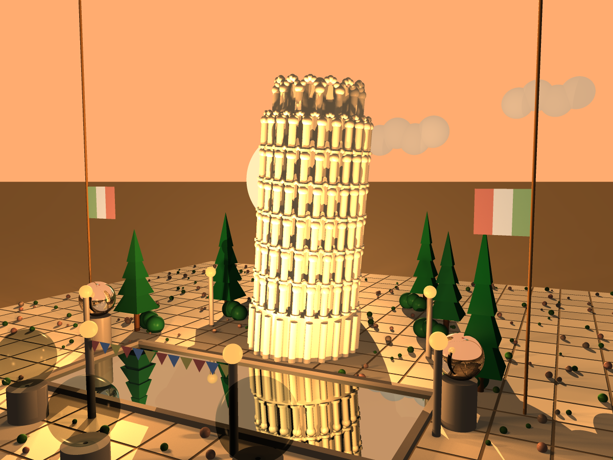
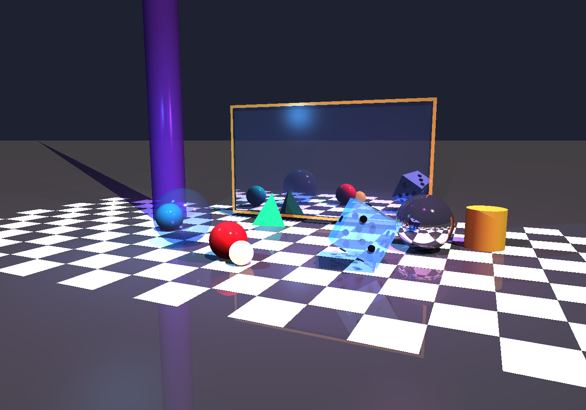
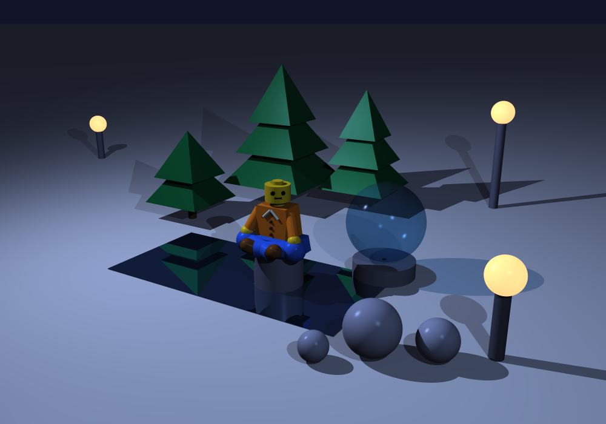
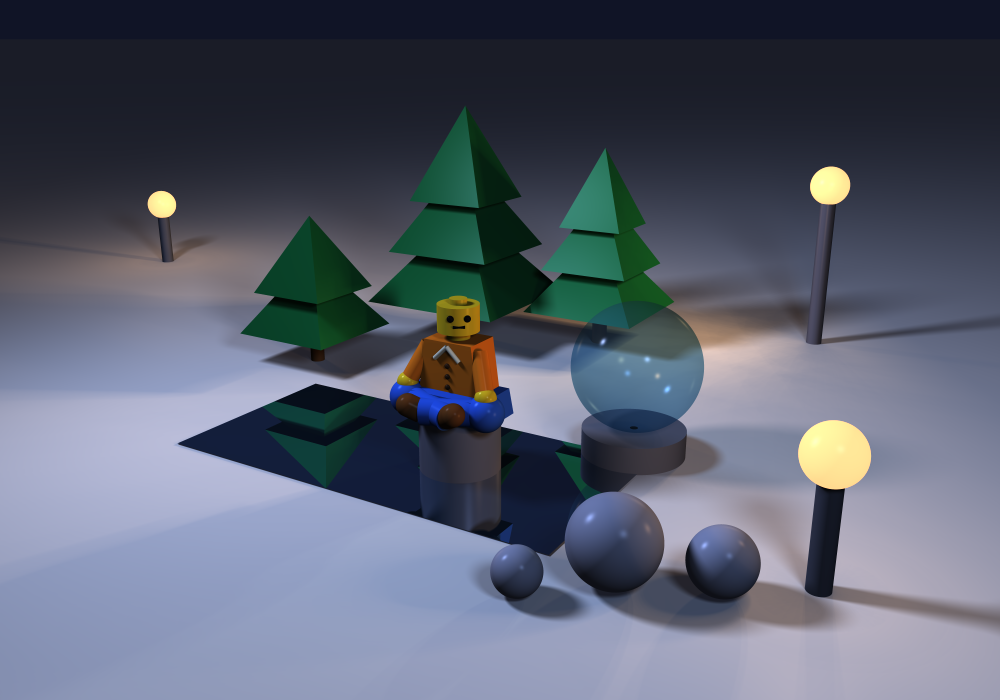
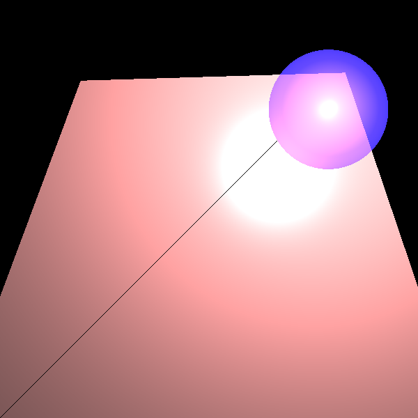

# 🎨 Java Ray Tracer

> A from-scratch **ray-tracing renderer** written in pure Java — no graphics libraries, just math, light, and clean object-oriented design.

Developed as part of a Software Engineering project, this renderer is built from core mathematical foundations into a full physically-inspired rendering engine: shadows, reflections, transparent glass, soft area lights, anti-aliasing, multithreading, and spatial acceleration structures.

<p align="center">
  
  <br>
  <em>The Leaning Tower of Pisa at golden hour — soft shadows, six light sources, 2,465 geometries.</em>
</p>

---

## 📑 Table of Contents

- [Features](#-features)
- [Gallery](#-gallery)
- [Performance (MP2)](#-performance-mp2)
- [Architecture](#-architecture)
- [Project Structure](#-project-structure)
- [Getting Started](#-getting-started)
- [How It Works](#-how-it-works)
- [Design Principles](#-design-principles)
- [Roadmap](#-roadmap)

---

## ✨ Features

| Category | What it does |
|---|---|
| **Geometric primitives** | Points, vectors, rays, and full 3-D vector algebra with safe floating-point comparisons |
| **Shapes** | Sphere, Plane, Triangle, Polygon, Tube, Cylinder — each with ray-intersection and normals |
| **Camera** | Configurable view plane and resolution, built with a fluent **Builder** pattern |
| **Lighting** | Ambient, Directional, Point, and Spot lights with the **Phong** reflectance model (diffuse + specular) |
| **Shadows** | Hard shadows via shadow rays, plus **soft shadows** from area lights |
| **Reflection & refraction** | Mirror surfaces and transparent glass with recursive secondary rays and partial shadows |
| **Anti-aliasing** | Multiple jittered rays per pixel for smooth, crisp edges |
| **Super-sampling engine** | One reusable **beam sampler** ("blackboard") powering both anti-aliasing and soft shadows |
| **Multithreading** | Parallel rendering via raw threads or parallel streams for dramatic speedups |
| **Acceleration** | Conservative Bounding Regions (CBR) and a Bounding Volume Hierarchy (BVH) for fast scenes with many objects |
| **Scene loading** | Optional JSON scene parser — describe scenes in data, not code |

---

## 🎨 Gallery

### Anti-Aliasing
Several rays are cast through different points inside each pixel and averaged, removing the jagged "staircase" edges of single-ray rendering.

| Without anti-aliasing | With anti-aliasing |
|:---:|:---:|
|  |  |

### Soft Shadows
Area lights cast many shadow rays, producing realistic soft penumbrae instead of hard, knife-edge shadows.

| Hard shadows | Soft shadows |
|:---:|:---:|
|  |  |

### Reflection & Refraction
Recursive rays bring mirror reflections and transparent, light-bending glass to life.

| Crystal Gallery | Refraction & shadows |
|:---:|:---:|
|  |  |

### Mesh Rendering
A classic Utah Teapot, rendered triangle-by-triangle.

<p align="center">
  
</p>

> 💡 All images above are produced by the test suite and saved to the `images/` folder.

---

## ⚡ Performance (MP2)

The acceleration work is benchmarked on one demanding scene — the **Leaning Tower of Pisa**: **2,465 geometries** lit by **6 light sources**, rendered at **640×480** with soft shadows (the MP1 effect kept on at quality). Each measurement is its own test that renders the *same* scene and camera and prints its wall-clock time, so the speedups read straight off the numbers.

The two accelerators measured are **CBR** (Conservative Bounding Region — a per-object bounding-box early-reject) and **BVH** (Bounding Volume Hierarchy — grouping objects so a whole cluster can be skipped at once), each tested **without** and **with** multithreading.

### Full timing table — Pisa scene (seconds)

| Configuration | Single thread | Multithreaded |
|---|--:|--:|
| Flat list, no CBR *(baseline)* | 395.9 s | 44.3 s |
| Flat list, CBR | 121.8 s | 12.9 s |
| Manual BVH, no CBR | 397.6 s | 44.3 s |
| Manual BVH, CBR | 40.5 s | 4.5 s |
| Automatic BVH, no CBR | 665.1 s | 70.0 s |
| **Automatic BVH, CBR** | **11.2 s** | **1.5 s** |

> Each row corresponds to a saved `images/pisa_*` render. Note that a hierarchy *without* CBR gives no benefit — it is the box test that actually prunes rays.

### The four corners & speedups

| Configuration | Render time | Speedup vs. baseline |
|---|--:|--:|
| Acceleration OFF · MT OFF *(baseline)* | 395.9 s | 1× |
| Acceleration OFF · MT ON | 44.3 s | 8.9× |
| Acceleration ON · MT OFF | 11.2 s | 35.2× |
| **Acceleration ON · MT ON** | **1.5 s** | **271.9×** |

- **Multithreading alone** ≈ **8.9×** (≈7.7× averaged across all configurations).
- **BVH + CBR alone** (single thread) ≈ **35.2×**.
- **Both together** ≈ **272×** — from 6½ minutes down to **1.5 seconds**, with the automatic-BVH build cost (tens of milliseconds) negligible against the render.

### BVH demo scene (400×400, single thread, milliseconds)

A second, lighter scene isolates the structure speedup on its own:

| Structure | No CBR | CBR |
|---|--:|--:|
| Flat list | 926 ms | 325 ms |
| Manual BVH | 1003 ms | 32 ms |
| Automatic BVH | 1935 ms | 35 ms |

CBR alone speeds the flat scene ≈**2.8×**; automatic BVH **+** CBR reaches ≈**26×** over the no-acceleration baseline.

---

## 📐 Architecture

The renderer follows a clean, layered design where each package has a single, well-defined responsibility:

```
        ┌──────────────┐
        │    scene     │   Scene = geometries + lights + background
        └──────┬───────┘
               │
   ┌───────────┼────────────┐
   │           │            │
┌──▼───┐  ┌────▼─────┐  ┌───▼──────┐
│lighting│ │geometries│  │ renderer │
│       │ │ api+impl │  │ Camera + │
│Phong, │ │ shapes,  │  │RayTracer │
│lights │ │ BVH/AABB │  │ + beams  │
└──┬────┘ └────┬─────┘  └───┬──────┘
   │           │            │
   └───────────┼────────────┘
               │
        ┌──────▼───────┐
        │  primitives  │   Point, Vector, Ray, Color, Material…
        └──────────────┘
```

- **`primitives`** — the mathematical foundation: vectors, points, rays, colors, materials, and an axis-aligned bounding box (AABB).
- **`geometries`** — split into `api` (the `Intersectable` / `Geometry` abstractions) and `impl` (concrete shapes + a `Geometries` composite), respecting the **Dependency Inversion Principle**.
- **`lighting`** — light sources and the Phong shading model.
- **`renderer`** — the `Camera` (Builder pattern), the `SimpleRayTracer` color pipeline, the `BeamSampler` super-sampling engine, and multithreading support.
- **`scene`** — bundles everything a renderer needs into one object.
- **`parser`** — optional JSON-to-scene loader, kept fully decoupled from the rendering core.

---

## 📂 Project Structure

```
src/
├── primitives/     Point, Vector, Ray, Color, Material, Util, AABB, Double3
├── geometries/
│   ├── api/        Intersectable, Geometry (abstractions)
│   └── impl/       Sphere, Plane, Triangle, Polygon, Tube, Cylinder, Geometries
├── renderer/       Camera, SimpleRayTracer, BeamSampler, ImageWriter, PixelManager
├── lighting/       AmbientLight, Directional/Point/Spot lights
├── scene/          Scene
└── parser/         JSON scene loading

unittests/          JUnit 5 tests mirroring the src/ packages
json/               Example scenes in JSON
images/             Rendered output images
```

---

## 🚀 Getting Started

### Requirements
- **Java 25** (JDK)
- **JUnit 5** and **org.json** (resolved automatically from the local Maven repository — see `.idea/libraries/`)
- **IntelliJ IDEA** recommended (this is a plain IntelliJ project — no Maven/Gradle build file)

### Run in IntelliJ
1. Open the project folder in IntelliJ IDEA.
2. Make sure the Project SDK is set to **Java 25**.
3. Right-click any test class in `unittests/` (e.g. `renderer/PisaTests`) and choose **Run**.
4. Rendered images appear in the `images/` folder.

> ℹ️ This is intentionally a dependency-light, IDE-driven project, so there is no `mvn`/`gradle` command. Rendering is driven entirely through the JUnit test classes, each of which sets up a scene, configures a camera, and writes an image.

---

## 🔬 How It Works

At its heart, ray tracing simulates light **in reverse** — instead of following photons from lights into the eye, we shoot rays *from the camera through each pixel* into the scene and ask: *what does this ray see?*

For every pixel:

1. **Cast a ray** from the camera through the pixel on the view plane.
2. **Find the closest intersection** with any geometry in the scene.
3. **Compute the color** at that point:
   - the surface's own emission,
   - **ambient** light,
   - **local** lighting (Phong diffuse + specular) for each light source — checking shadows along the way,
   - **global** effects via recursive rays for **reflection** and **transparency**.
4. **Write the color** to the output image.

### Super-sampling
Rather than one ray per pixel, the **`BeamSampler`** generates a beam of rays distributed over a target area (using grid, stochastic, or **jittered** patterns) and averages the results. This single, reusable engine powers both **anti-aliasing** (rays spread across the pixel) and **soft shadows** (shadow rays spread across an area light).

### Going fast
- **Multithreading** splits the image across CPU cores (raw threads with a `PixelManager` mutex, or parallel streams).
- **CBR / BVH** wrap geometries in bounding boxes so the tracer can cheaply skip rays that can't possibly hit an object — essential for scenes with hundreds or thousands of shapes.

---

## 🧭 Design Principles

This project is as much a software-engineering exercise as a graphics one. The codebase deliberately applies:

- **Immutability** — primitives and geometries are immutable; every operation returns a *new* object.
- **No setters / no getters** (except where explicitly justified) — favouring expressive, intention-revealing APIs.
- **Design patterns** — Builder (`Camera`), Composite (`Geometries`), Template Method / NVI (`Intersectable`), Factory (scene parsing).
- **DRY & SRP** — one beam-sampling engine for all super-sampling effects; parsing kept out of the rendering core.
- **TDD** — features are defined, documented, tested, then implemented, with EP/BVA-driven JUnit 5 tests.
- **Safe floating-point math** — comparisons go through `Util.isZero` / `Util.alignZero`, never raw `==` against zero.

---

## 🎯 Roadmap

The project is built in tagged stages:

| Stage | Topic |
|---|---|
| `PR01` | Primitives & geometric shapes |
| `PR02` | Unit tests + normals (TDD) |
| `PR03` | Ray–geometry intersections + `Geometries` composite |
| `PR04` | Camera (Builder) + ray construction |
| `PR05` | Rendering pipeline + Color + Ambient light + Scene |
| `PR06` | Emission + Material |
| `PR07` | Light sources + Phong shading |
| `PR08` | Shadows, reflection, transparency, partial shadows |
| **`MP01`** | Super-sampling (anti-aliasing + soft shadows) & multithreading |
| **`MP02`** | Acceleration (CBR / BVH) & performance |

---

<p align="center"><sub>Built with ☕ Java and a lot of linear algebra · ISE5786_9749_5354</sub></p>
